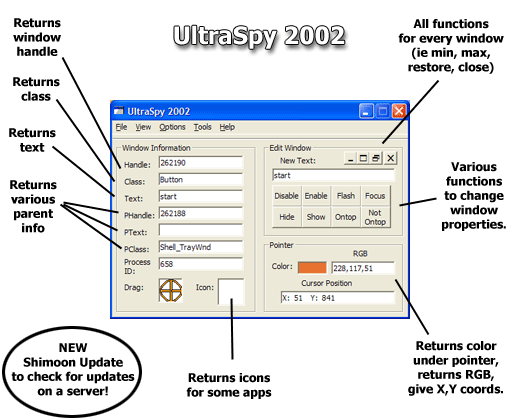

## UltraSpy 2002

### Description

After 3 months its back - and better then ever! Tonnes of new features such as Shimoon Update which will check a server for an update! Please check it out and vote for it if you like it. Leave comments as well. Best yet - its Windows XP compatible.
 
### More Info
 

             |
---                |---
**Submitted On**   |2001-11-13 22:27:30
**By**             |[Armen Shimoon](https://github.com/Planet-Source-Code/PSCIndex/blob/master/ByAuthor/armen-shimoon.md)
**Level**          |Intermediate
**User Rating**    |4.3 (17 globes from 4 users)
**Compatibility**  |VB 6\.0
**Category**       |[Windows API Call/ Explanation](https://github.com/Planet-Source-Code/PSCIndex/blob/master/ByCategory/windows-api-call-explanation__1-39.md)
**World**          |[Visual Basic](https://github.com/Planet-Source-Code/PSCIndex/blob/master/ByWorld/visual-basic.md)
**Archive File**   |[UltraSpy\_23516711142001\.zip](https://github.com/Planet-Source-Code/armen-shimoon-ultraspy-2002__1-28887/archive/master.zip)

